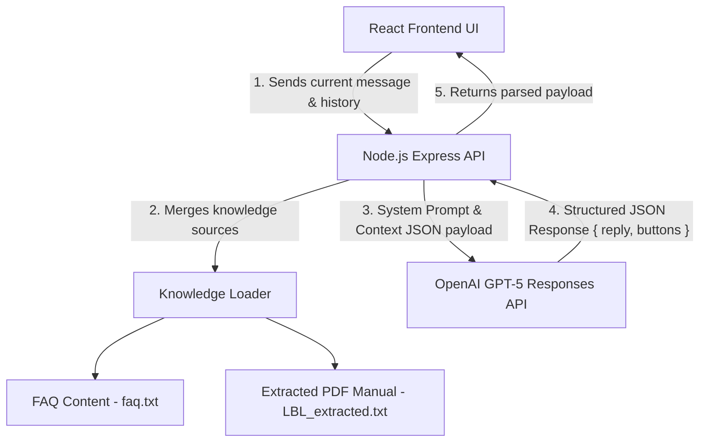

# LBL Support Assistant

An AI-powered customer support chatbot designed to serve as the first line of support for the Lincoln Benefit Life (LBL) Portal. The chatbot resolves portal-related queries strictly using LBL Portal documentation and FAQs, dynamically guiding users to specific categories based on their role.

---

## 🏗️ Architecture & Flow



---

## ✨ Features

- **Dynamic Clarification**: Prompts the user to specify context using clickable selection buttons when a query is vague or incomplete (e.g. *"I can't log in"*).
- **Role-Based Category Navigation**: Branches support topics based on the user's role:
  - **Agent**: Registration, Password Reset, MFA, Session Timeout, Email Updates, Outages.
  - **Owner**: Policy linking, Profile Updates, Delete Account request, Registration.
  - **Home Office**: Operational assistance, Impersonation support details, Jira and ServiceNow ticket rules.
- **Tidy Conversation Log**: Selection buttons automatically clear from the chat log once selected to prevent multiple clicks and keep the chat history neat.
- **Premium Glassmorphic Interface**: A fully responsive interface featuring Outfit typography, smooth animations, welcome cards, and a toggle for **Light / Dark Mode**.
- **Conversation Context Tracking**: Feeds conversation history to the backend API to handle multi-turn question narrowing.

---

## 🚀 Getting Started

### Prerequisites
- Node.js (v18+)
- npm

### 1. Backend Setup
1. Navigate to the backend directory:
   ```bash
   cd backend
   ```
2. Install dependencies:
   ```bash
   npm install
   ```
3. Configure environment variables in `backend/.env`:
   ```env
   OPENAI_API_KEY=your_openai_api_key
   PORT=6262
   ```
4. Start the server in development mode:
   ```bash
   npm run dev
   ```
   The backend will start running on `http://localhost:6262`.

### 2. Frontend Setup
1. Navigate to the frontend directory:
   ```bash
   cd ../frontend
   ```
2. Install dependencies:
   ```bash
   npm install
   ```
3. Configure environment variables in `frontend/.env`:
   ```env
   VITE_API_URL=http://localhost:6262
   ```
4. Start the development server:
   ```bash
   npm run dev
   ```
   Open `http://localhost:3232/` in your browser to interact with the LBL Support Assistant.